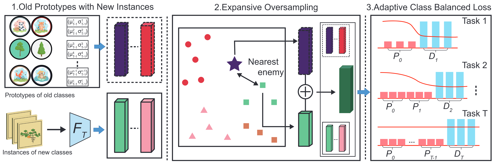

# Revisiting Prototype Rehearsal for Exemplar-Free Continual Learning (CVPR 2026 Findings)

## Manifold-Aware Boundary Sampling with Adaptive Class-Balanced Loss



This repository contains the implementation for our prototype-rehearsal based method for exemplar-free class-incremental learning (EFCIL). The current codebase is built on top of the earlier EFC repository and extends it with two key components introduced in the paper:

- **Constrained Expansive Over-Sampling (CEOS)**: generates boundary-aware rehearsal features by interpolating each old-class prototype toward its nearest enemy feature from the current task.
- **Adaptive Class-Balanced (ACB) Loss**: corrects the hidden imbalance between a small number of prototype-based old-class samples and the much larger number of real new-class samples.

Together, these components turn prototype rehearsal into a drift-resilient and imbalance-aware mechanism that closes, and often reverses, the gap to recent drift-compensation methods.

---

## Abstract

Exemplar-free class-incremental learning (EFCIL) aims to acquire new classes over time without storing raw data. Prototype rehearsal has long been a standard way to reduce forgetting in this setting, but recent drift-compensation methods often outperform it. Our paper argues that the gap comes not from prototype rehearsal itself, but from how it is commonly instantiated: standard methods ignore nearby enemy classes when generating rehearsal features, and they do not properly address the growing imbalance between a few synthetic old-class samples and many real new-class samples.

To address this, we revisit prototype rehearsal from a manifold-aware and imbalance-aware perspective. We propose **CEOS**, which expands each old-class prototype toward its nearest enemy features while preserving prototype dominance, and **ACB**, which applies time-dependent class weighting so older prototypes are emphasized when they are most informative and gradually down-weighted as more supervision accumulates. The resulting framework achieves strong performance across multiple EFCIL benchmarks.

---

## Method Overview

### 1. Prototype rehearsal

For previously learned classes, the model maintains prototype distributions and samples synthetic old-class features during later tasks.

### 2. Constrained Expansive Over-Sampling (CEOS)

For each prototype feature, CEOS retrieves its nearest enemy feature from the current-task batch and interpolates toward it. This produces boundary-focused rehearsal samples that better follow the data manifold while reducing the risk of collapsing into neighboring classes.

### 3. Adaptive Class-Balanced (ACB) Loss

ACB assigns time-dependent class weights to counter the effective long-tail imbalance that appears in EFCIL. In practice, this implementation is enabled by combining class-balanced loss with temporal weighting options.


## Environment Setup

You can either use the provided `environment.yml` or manually create the environment with the versions below.

```bash
conda create -n yourenv python=3.10 -y
conda activate yourenv

# PyTorch (CUDA 12.6 wheels)
pip install torch==2.7.0 torchvision==0.22.0 torchaudio==2.7.0 \
  --index-url https://download.pytorch.org/whl/cu126

# Core libs
pip install einops==0.8.1 \
  numpy==2.2.5 scipy==1.15.2 pandas==2.2.3 scikit-learn==1.6.1 \
  matplotlib==3.10.0 pillow==11.2.1 tqdm==4.67.1 pyyaml==6.0.2
```

If your machine uses a different CUDA version, please replace the PyTorch wheel index accordingly.

---

## Main Arguments

### General training

- `-op`, `--outpath`: output directory.
- `--dataset`: dataset name.
- `--data_path`: dataset root.
- `--seed`: random seed.
- `--device`: CUDA device id.
- `--nw`: number of dataloader workers.
- `--epochs_first_task`: epochs for the first task.
- `--epochs_next_task`: epochs for subsequent tasks.
- `--n_task`: number of tasks.
- `--n_class_first_task`: number of classes in the first task.

### CEOS / ACB options used in the paper

- `--eos`: enable Constrained Expansive Over-Sampling.
- `--eos_k`: number of nearest enemies used for CEOS. The paper uses `k=1`.
- `--cb_loss`: enable class-balanced loss.
- `--balanced_weight`: enable balanced virtual counts for old classes.
- `--ascending_weight`: enable time-dependent ascending virtual counts.
- `--start_old`: minimum virtual count for old classes.
- `--focal_loss`: optional focal-loss baseline.

### Optional feature-space CutMix

- `--cutmix`
- `--cutmix_contiguous`
- `--cutmix_alpha`
- `--cutmix_lambda`

---

## Recommended Command for the Current CEOS + ACB Configuration

The following command matches the current prototype-rehearsal setting you shared for CIFAR-100 10-step cold-start training:

```bash
CUDA_VISIBLE_DEVICES=0 python -u main.py \
  -op ./cs_cifar100_10 \
  --dataset cifar100 \
  --n_task 10 \
  --n_class_first_task 10 \
  --data_path /data \
  --approach efc \
  --nw 12 \
  --seed 0 \
  --epochs_first_task 100 \
  --epochs_next_task 100 \
  --eos \
  --cb_loss \
  --balanced_weight \
  --ascending_weight \
  --eos_k 1 \
  --start_old 100
```

If you have already renamed the codebase from `efc` to `ceos`, simply replace `--approach efc` with `--approach ceos`, and similarly rename legacy `efc_*` flags if your parser has been updated.

---

## Results and Logging

Training results are written to the directory specified by `-op`.
The repository logs per-task accuracy matrices and a `summary.csv` file.

Typical metrics include:

- `Per_step_taw_acc`: task-aware accuracy after each task.
- `Last_per_step_taw_acc`: task-aware accuracy measured after the final task.
- `Per_step_tag_acc`: task-agnostic accuracy after each task.
- `Last_per_step_tag_acc`: task-agnostic accuracy measured after the final task.
- `Average_inc_acc`: average incremental accuracy.


---

## Acknowledgment

This implementation builds on the earlier public EFC codebase and extends it with the CEOS and ACB components introduced in the new paper.
